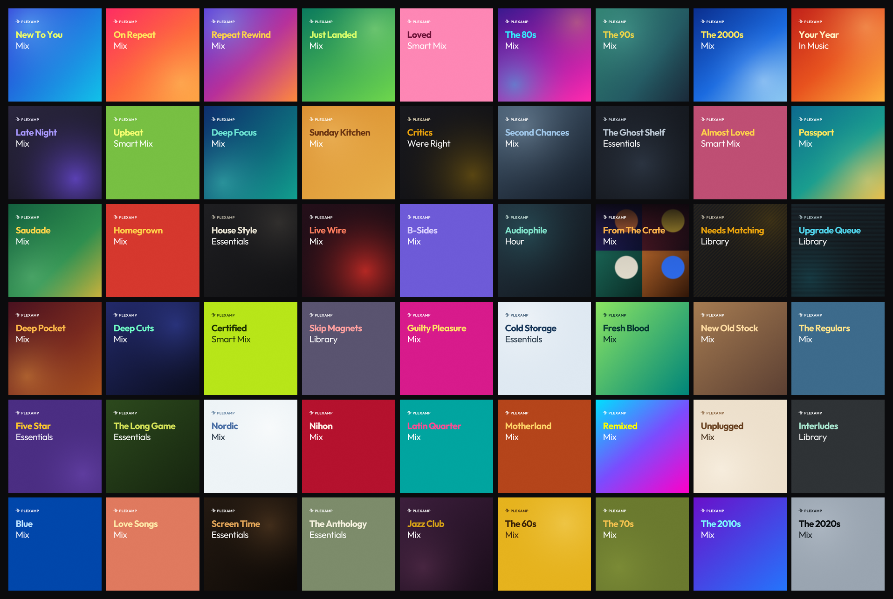

# Plex Smart Mixes

Smart playlist recipes and cover art to make Plexamp feel like a streaming app.
54 filters, each with a poster, background and logo.



---

## Why

Plex already has everything needed to build the shelves Spotify and Apple Music
put on their home screens. The filters are just buried, and the results come out
looking like a folder of files.

A few of these can't exist on a streaming service at all. **Critics Were Right**
finds acclaimed albums you own and have never once played. **The Ghost Shelf**
finds albums that have sat untouched for over a year. Neither is possible unless
the app knows what's on your shelf, not only what you streamed.

---

## Contents

- [Building a smart playlist](#building-a-smart-playlist)
- [Setting the description](#setting-the-description)
- [Setting the artwork](#setting-the-artwork)
- [Sorting and limits](#sorting-and-limits)
- [The playlists](#the-playlists)
  - [Streaming staples](#streaming-staples)
  - [Time machine](#time-machine)
  - [Mood and context](#mood-and-context)
  - [The ones streaming can't do](#the-ones-streaming-cant-do)
  - [Listening habits](#listening-habits)
  - [Around the world](#around-the-world)
  - [In the title](#in-the-title)
  - [By genre](#by-genre)
  - [Library hygiene](#library-hygiene)
- [Artwork specification](#artwork-specification)
- [Notes](#notes)

---

## Building a smart playlist

Once you've done one, the rest take about a minute each.

1. Open your **Music** library in Plex web
2. Set the type dropdown to **Tracks**
3. Click **Advanced Filters**
4. Build the filter rows from the recipes below
5. Set the sort from the column header — it's saved with the playlist, so do it
   before saving
6. Fill **LIMIT TO** only when the recipe asks for one
7. **Save As…** → name it → **Save as Smart Playlist**

**Sorting in Tracks view works differently than Albums view.** Albums view has a
sort dropdown. Tracks view doesn't, instead, click the column header itself
(Plays, Date Added, Rating, etc.) to sort by that field, click it again to flip
between ascending and descending. It's not a dropdown, but it's not broken either,
it's just a different control for the same thing.

### Match all vs Match any

Most recipes use **Match all**, where every row must be true. A few need a nested
**Match any** block, which is the `⋮` button beside the `+`. The mood playlists
use it to catch several mood tags at once.

### A note on Mood and Style fields

`Track Mood` and `Album Style` only support **is**, not **contains**, in the
current Plex Web filter editor. If a recipe below shows `contains`, build it as
one **is** row per value inside a **Match any** group instead. For example:

```
Match any
Track Mood   is   melancholy
Track Mood   is   reflective
Track Mood   is   sombre
Track Mood   is   dreamy
```

rather than a single `Track Mood contains melancholy` row, which isn't available
as an option.

### A note on Album Critic Rating

This field shows as a five-star click control in Plex Web, not a numeric input.
There's no way to type a decimal like `7.9`. Use the star equivalent instead,
roughly `rating ÷ 2`, so 7.9/10 becomes **4 stars**. It's an approximation, not
an exact conversion.

It's also not currently sortable directly. **Popularity** is a reasonable
stand-in if you want a ranked order, it's independent of your own play count, so
it won't just re-surface whatever you've already played the most.

---

## Setting the description

Descriptions show under the playlist title in Plexamp and in the Plex apps. They
have to be set from Plex web — Plexamp reads them but can't edit them.

1. Open the playlist in **Plex web**
2. Click the **⋯** menu → **Edit**
3. Fill in the **Summary** field
4. **Save Changes**

Each playlist below has a description written for this field. Copy it as-is or
rewrite it in your own voice.

---

## Setting the artwork

Plex gives every playlist three separate artwork slots, and this repo has a file
for each one.

| Slot | What it does | Folder |
|---|---|---|
| **Poster** | The square cover in every grid and list | `art/posters/` |
| **Background** | Fills the playlist page behind the title | `art/backgrounds/` |
| **Logo** | Replaces the plain-text title on the playlist page | `art/logos/` |

**To set them:**

1. Open the playlist in **Plex web**
2. Click the **⋯** menu → **Edit**
3. Across the top of the edit dialog you'll see tabs for **Poster**, **Background**
   and **Logo**
4. Pick a tab → **Upload** → choose the matching file from this repo
5. Repeat for the other two tabs, then **Save Changes**

Every playlist below lists its three filenames. They all share the same numbered
prefix, so `01-new-to-you.png`, `01-new-to-you-bg.png` and `01-new-to-you-logo.png`
belong together.

**Don't skip the logo.** It's the slot people ignore, and it's the one that
carries the look — without it Plex renders your playlist name in its own font
over the background, which undoes most of the effect.

---

## Sorting and limits

This part trips people up, so it's worth being precise.

**With a LIMIT, the sort decides what's in the playlist.** `Limit 40` sorted by
`Track Plays (desc)` means "the 40 most-played." Change the sort and you get 40
completely different tracks. That's the definition of the playlist, not the
running order.

**Without a LIMIT, the sort is only the stored order** — and Plexamp's shuffle
overrides it the moment you press play. So it doesn't matter.

That's why only 12 of the 54 below specify a sort at all. The rest are unlimited:
press shuffle and let them run.

**There is no Random sort in the smart playlist editor.** It exists while
browsing a library but doesn't survive Save As. You don't need it — shuffle
re-rolls on every play anyway.

Each playlist is tagged:

- **Open** — no limit, shuffle at playback
- **Ordered** — no limit, but play it top-down
- **Selected** — the limit and sort define the contents

---

## The playlists

### Streaming staples

#### 1. New To You — *Mix* · Open

> Music you own but have never played, by the artists you've been listening to
> lately. Your library's blind spots, surfaced.

```
Match all
Track Plays          is            0
Artist Last Played   in the last   90 days
```

Discover Weekly's logic, pointed at your own library. Don't add a limit — every
sort option hands you the same handful of artists forever.

`01-new-to-you.png` · `01-new-to-you-bg.png` · `01-new-to-you-logo.png`

---

#### 2. On Repeat — *Mix* · Selected

> The songs you can't stop going back to this month. Updated as your habits
> shift.

```
Match all
Track Plays          is greater than   4
Track Last Played    in the last       30 days

Limit 40 · Sort: Track Plays (desc)
```

`02-on-repeat.png` · `02-on-repeat-bg.png` · `02-on-repeat-logo.png`

---

#### 3. Repeat Rewind — *Mix* · Selected

> Songs you played into the ground and then walked away from. Enough time has
> passed to miss them.

```
Match all
Track Plays          is greater than   9
Track Last Played    not in the last   120 days

Limit 50 · Sort: Track Plays (desc)
```

`03-repeat-rewind.png` · `03-repeat-rewind-bg.png` · `03-repeat-rewind-logo.png`

---

#### 4. Just Landed — *Mix* · Ordered

> Everything that arrived in the library this month, newest first. The first
> place to look after an import.

```
Match all
Track Added At       in the last   30 days

Sort: Track Added At (desc)
```

Don't shuffle this one. You read it top-down to see what just showed up.

`04-just-landed.png` · `04-just-landed-bg.png` · `04-just-landed-logo.png`

---

#### 5. Loved — *Smart Mix* · Ordered

> Every track you've rated four stars or higher. The permanent collection.

```
Match all
Track Rating         is   4

Sort: Track Last Rated (desc)
```

Deliberately four stars only, not "four and up". Together with Almost Loved
(exactly 3) and Five Star (5), the three form a ladder with no overlap between
them, rather than three lists that all return the same songs.

`05-loved.png` · `05-loved-bg.png` · `05-loved-logo.png`

---

### Time machine

#### 51. The 60s — *Mix* · Open

> Where most of it starts. Everything in the library from 1960 to 1969.

```
Match all
Album Decade         is    1960
```

`51-the-60s.png` · `51-the-60s-bg.png` · `51-the-60s-logo.png`

---

#### 52. The 70s — *Mix* · Open

> Ten years of the library, from the tail of psychedelia to the start of
> everything that came after it.

```
Match all
Album Decade         is    1970
```

`52-the-70s.png` · `52-the-70s-bg.png` · `52-the-70s-logo.png`

---

#### 6. The 80s — *Mix* · Open

> Big rooms, bigger reverb, and drum machines that refused to apologise.
> Everything in the library from 1980 to 1989.

```
Match all
Album Decade         is    1980
```

`06-the-80s.png` · `06-the-80s-bg.png` · `06-the-80s-logo.png`

---

#### 7. The 90s — *Mix* · Open

> The decade the guitars got heavier and the CDs got longer. Ten years of the
> library, shuffled.

```
Match all
Album Decade         is    1990
```

`07-the-90s.png` · `07-the-90s-bg.png` · `07-the-90s-logo.png`

---

#### 8. The 2000s — *Mix* · Open

> Burned discs, ripped MP3s, and the last decade before an algorithm started
> deciding what came next.

```
Match all
Album Decade         is    2000
```

`08-the-2000s.png` · `08-the-2000s-bg.png` · `08-the-2000s-logo.png`

---

#### 53. The 2010s — *Mix* · Open

> Streaming took over halfway through. Whatever you kept a copy of is here.

```
Match all
Album Decade         is    2010
```

`53-the-2010s.png` · `53-the-2010s-bg.png` · `53-the-2010s-logo.png`

---

#### 54. The 2020s — *Mix* · Open

> The current decade, still filling up.

```
Match all
Album Decade         is    2020
```

`54-the-2020s.png` · `54-the-2020s-bg.png` · `54-the-2020s-logo.png`

---

#### 9. Your Year — *In Music* · Selected

> The hundred tracks you actually played most over the last twelve months.
> Rebuild it every January.

```
Match all
Track Last Played    in the last       365 days
Track Plays          is greater than   2

Limit 100 · Sort: Track Plays (desc)
```

A countdown, so the sort does double duty — it picks the hundred and ranks them.

`09-your-year-in-music.png` · `09-your-year-in-music-bg.png` · `09-your-year-in-music-logo.png`

---

### Mood and context

These lean on Plex's Mood and Style metadata, which comes from the metadata agent
and varies with how well-matched your library is. Check a few tracks before
trusting it — if Track Mood is thin, Album Mood and Album Style are usually
better populated.

#### 10. Late Night — *Mix* · Open

> For the hours after midnight, when the volume comes down and everything sounds
> further away.

```
Match any
Track Mood   is   melancholy
Track Mood   is   reflective
Track Mood   is   sombre
Track Mood   is   dreamy
```

`10-late-night.png` · `10-late-night-bg.png` · `10-late-night-logo.png`

---

#### 11. Upbeat — *Smart Mix* · Open

> Anything in the library with a pulse. Built for kitchens, commutes, and getting
> out the door.

```
Match any
Track Mood   is   energetic
Track Mood   is   rowdy
Track Mood   is   exuberant
```

`11-upbeat.png` · `11-upbeat-bg.png` · `11-upbeat-logo.png`

---

#### 12. Deep Focus — *Mix* · Open

> Instrumental and atmospheric music that stays out of the way. Nothing here asks
> you to sing along.

```
Match all
  Match any
  Album Style   is   ambient
  Album Style   is   post-rock
  Album Style   is   instrumental
Track Plays    is greater than   0
```

`12-deep-focus.png` · `12-deep-focus-bg.png` · `12-deep-focus-logo.png`

---

#### 13. Sunday Kitchen — *Mix* · Open

> Warm, familiar, mid-tempo. Music to cook to with someone else in the room.

```
Match all
Track Rating   is greater than   2
  Match any
  Track Mood   is   warm
  Track Mood   is   laid-back
  Track Mood   is   gentle
```

`13-sunday-kitchen.png` · `13-sunday-kitchen-bg.png` · `13-sunday-kitchen-logo.png`

---

#### 28. Deep Pocket — *Mix* · Open

> Bass up front, guitar simmering underneath, vocals doing the rest. Sade to
> Hendrix range, whatever's got the pocket.

```
Match any
Track Genre   is   Soul
Track Genre   is   R&B
Track Genre   is   Funk
Track Genre   is   Blues Rock
```

Plex has no audio-feature data (no "danceability," no "groove"), so this leans
entirely on Genre tags, coverage depends on how well your library is tagged.
Hendrix in particular rarely gets filed as Soul or Funk, check what genre your
library actually assigns him and swap the last row to match.

If this comes back thin, try Mood instead of Genre as a second candidate:

```
Match any
Track Mood   is   sensual
Track Mood   is   smooth
Track Mood   is   groovy
```

Test both separately rather than combining them, mixing genre and mood rows in
one group tends to pull in unrelated stuff, smooth jazz and smooth pop both
matching "smooth," for instance.

`28-deep-pocket.png` · `28-deep-pocket-bg.png` · `28-deep-pocket-logo.png`

---

### The ones streaming can't do

#### 14. Critics Were Right — *Essentials* · Selected

> Acclaimed albums you own with at least one track you've never played. No
> streaming service can build this list, because none of them know what's on
> your shelf.

```
Match all
Album Critic Rating  is greater than   ★★★★  (4 stars)
Track Plays          is                0

Limit 50 · Sort: Popularity (desc)
```

`Album Critic Rating` is a five-star click control in Plex Web, not a numeric
field, there's no way to type `7.9` directly. Four stars is roughly the
equivalent. It's not sortable on its own either, Popularity is a reasonable
stand-in since it's independent of your own play count.

This uses `Track Plays`, not `Album Plays`, on purpose. An earlier version
filtered on `Album Plays is 0`, meaning the whole album had to be completely
untouched, but that turned out to be a much stricter bar than it sounds:
sample one track off a well-reviewed album years ago and it's disqualified
forever. `Track Plays is 0` catches acclaimed albums where you've heard
something but not most of it, which returns useful results for a lot more
libraries.

Want the stricter version back, whole album untouched, not just one track?
Swap the second row for `Album Plays is 0`. It can return very few results,
or none, depending on how much of your acclaimed music you've already sampled.

`14-critics-were-right.png` · `14-critics-were-right-bg.png` · `14-critics-were-right-logo.png`

---

#### 15. Second Chances — *Mix* · Open

> Tracks you skipped past months ago. Streaming treats a skip as a permanent
> verdict — this gives them another hearing.

```
Match all
Track Skips          is greater than   1
Track Last Skipped   not in the last   180 days
```

`15-second-chances.png` · `15-second-chances-bg.png` · `15-second-chances-logo.png`

---

#### 16. The Ghost Shelf — *Essentials* · Selected

> Albums that have sat in the library for over a year, completely untouched. The
> guilt list, oldest first.

```
Match all
Date Album Added     not in the last   365 days
Album Plays          is                0

Limit 50 · Sort: Date Album Added (asc)
```

Longest-neglected first. The sort is the guilt.

**If this comes back empty**, that's not necessarily a bug, it can genuinely
mean you've listened to at least one track off every album in your library
that's over a year old. `Album Plays is 0` is a strict filter, unlike the star
rating field above, it works correctly here, an empty result is a real result.

`16-the-ghost-shelf.png` · `16-the-ghost-shelf-bg.png` · `16-the-ghost-shelf-logo.png`

---

#### 17. Almost Loved — *Smart Mix* · Open

> Everything stuck at three stars. Songs you liked enough to rate and never
> resolved — promote them or let them go.

```
Match all
Track Rating         is        3
```

`17-almost-loved.png` · `17-almost-loved-bg.png` · `17-almost-loved-logo.png`

---

#### 18. Passport — *Mix* · Open

> Everything from outside the usual three countries. Your library's world
> service.

```
Match all
Artist Country       is not    United States
Artist Country       is not    United Kingdom
Artist Country       is not    Canada
```

This is the umbrella, it contains everything in Nordic, Nihon, Latin Quarter,
Motherland and Saudade. That's intentional, the same way a streaming app has a
broad "Global" shelf alongside specific ones. If you'd rather they didn't
overlap, add `is not` rows for the countries those five already cover.

`18-passport.png` · `18-passport-bg.png` · `18-passport-logo.png`

---

#### 19. Saudade — *Mix* · Open

> Brazilian and Portuguese artists — a word that doesn't translate, for music
> that doesn't need to.

```
Match any
Artist Country       is        Brazil
Artist Country       is        Portugal
```

Swap in whichever countries mean something to you.

`19-saudade.png` · `19-saudade-bg.png` · `19-saudade-logo.png`

---

#### 20. Homegrown — *Mix* · Open

> Canadian artists only. Deeper than you'd expect once you actually filter for
> it.

```
Match all
Artist Country       is        Canada
```

`20-homegrown.png` · `20-homegrown-bg.png` · `20-homegrown-logo.png`

---

#### 21. House Style — *Essentials* · Ordered

> One label, in release order. Pick a house you trust — 4AD, Blue Note, Sub Pop,
> Stones Throw, Warp — and let their A&R do the curating.

```
Match all
Record Label         contains   4AD

Sort: Year (asc)
```

The one playlist you should never shuffle. Hearing a label evolve
chronologically is the entire point.

`21-house-style.png` · `21-house-style-bg.png` · `21-house-style-logo.png`

---

#### 22. Live Wire — *Mix* · Open

> Concert recordings only. Longer, looser, and with a room full of people in the
> mix.

```
Match all
Album Type           is        Live
```

`22-live-wire.png` · `22-live-wire-bg.png` · `22-live-wire-logo.png`

---

#### 23. B-Sides — *Mix* · Open

> Singles and EPs — the tracks that never had an album to hide behind.

```
Match any
Album Format        is        Single
Album Format        is        EP
```

`23-b-sides.png` · `23-b-sides-bg.png` · `23-b-sides-logo.png`

---

#### 24. Audiophile — *Hour* · Open

> Lossless files, and only music you've already rated. For the good speakers and
> an evening with nothing else to do.

```
Match all
Audio Codec          is        flac
Track Rating         is greater than   3
```

`24-audiophile-hour.png` · `24-audiophile-hour-bg.png` · `24-audiophile-hour-logo.png`

---

#### 25. From The Crate — *Mix* · Open

> Vinyl rips, bootlegs, and anything else living in its own corner of the drive.
> Turns a folder into a station.

```
Match all
Folder Location      contains   /Vinyl
```

`25-from-the-crate.png` · `25-from-the-crate-bg.png` · `25-from-the-crate-logo.png`

---

### Listening habits

The behavioural data Plex quietly collects while you use it. None of this needs
good metadata, it works on any library.

#### 29. Deep Cuts — *Mix* · Open

> Tracks buried on albums you've already opened. You started the record, you
> just never got as far as these.

```
Match all
Album Plays   is greater than   0
Track Plays   is               0
```

The inverse of Critics Were Right, that one finds albums you never opened, this
finds what you missed inside the ones you did.

`29-deep-cuts.png` · `29-deep-cuts-bg.png` · `29-deep-cuts-logo.png`

---

#### 30. Certified — *Smart Mix* · Selected

> Played to death and never once skipped. The songs that have earned their spot.

```
Match all
Track Plays   is greater than   15
Track Skips   is less than      1

Limit 50 · Sort: Track Plays (desc)
```

If this comes back empty, drop the `Track Skips` row, some libraries store
"never skipped" as no value rather than a literal 0, which an `is less than 1`
comparison can miss. Plays alone still gets you most of the way there.

`30-certified.png` · `30-certified-bg.png` · `30-certified-logo.png`

---

#### 31. Skip Magnets — *Library* · Open

> Songs you keep skipping but never delete. Either fix that or admit you like
> them.

```
Match all
Track Skips         is greater than   3
Track Last Skipped  in the last       90 days
```

Three playlists use skip data and they're meant to be mutually exclusive. This
one is what you're skipping *now*. Second Chances is what you skipped and have
since left alone. Guilty Pleasure is the slice you skip despite having rated it
highly.

`31-skip-magnets.png` · `31-skip-magnets-bg.png` · `31-skip-magnets-logo.png`

---

#### 32. Guilty Pleasure — *Mix* · Open

> Rated highly, skipped constantly. The contradiction is the whole playlist.

```
Match all
Track Skips    is greater than   2
Track Rating   is greater than   3
```

`32-guilty-pleasure.png` · `32-guilty-pleasure-bg.png` · `32-guilty-pleasure-logo.png`

---

#### 33. Cold Storage — *Essentials* · Open

> Music you rated highly and haven't touched in a year. Still good. Still
> forgotten.

```
Match all
Track Rating       is greater than   3
Track Last Played  not in the last   365 days
```

`33-cold-storage.png` · `33-cold-storage-bg.png` · `33-cold-storage-logo.png`

---

#### 34. Fresh Blood — *Mix* · Open

> Artists that entered your library this month. Everything here is still a first
> impression.

```
Match all
Date Artist Added   in the last   30 days
Track Plays         is            0
```

Just Landed shows everything that arrived this month, including new records by
artists you already own. This is narrower on purpose: artists who are new to the
library *and* whose music you haven't played yet.

`34-fresh-blood.png` · `34-fresh-blood-bg.png` · `34-fresh-blood-logo.png`

---

#### 35. New Old Stock — *Mix* · Open

> Old records you only just got around to. New to your shelf, not to the world.

```
Match all
Date Album Released   is before      2005-01-01
Track Added At        in the last    60 days
```

Adjust the cutoff year to taste.

`35-new-old-stock.png` · `35-new-old-stock-bg.png` · `35-new-old-stock-logo.png`

---

#### 36. The Regulars — *Mix* · Open

> The rest of the catalogue from whoever you're into this week. Not the songs
> you keep replaying, the ones sitting next to them.

```
Match all
Artist Last Played   in the last        7 days
Track Last Played    not in the last    90 days
```

The second row is what keeps this out of On Repeat's territory. On Repeat gives
you what you're already playing, this gives you everything else by the same
artists.

`36-the-regulars.png` · `36-the-regulars-bg.png` · `36-the-regulars-logo.png`

---

#### 37. Five Star — *Essentials* · Open

> Only the ones you gave the full five. No almosts.

```
Match all
Track Rating   is greater than   4
```

The top rung. Almost Loved is exactly 3, Loved is exactly 4, this is 5, so no
track can appear in more than one of them.

`37-five-star.png` · `37-five-star-bg.png` · `37-five-star-logo.png`

---

#### 38. The Long Game — *Essentials* · Open

> In your library over three years and still in rotation. These are the ones
> that stuck.

```
Match all
Date Album Added    not in the last   1095 days
Track Last Played   in the last       30 days
```

1095 days is three years. The opposite of The Ghost Shelf, same time window,
opposite outcome.

`38-the-long-game.png` · `38-the-long-game-bg.png` · `38-the-long-game-logo.png`

---

### Around the world

Same idea as Passport, but pointed at specific places. Depends on `Artist
Country` being populated, check coverage before building all four.

#### 39. Nordic — *Mix* · Open

> Sweden, Norway, Denmark, Finland, Iceland. Cold climate, warm records.

```
Match any
Artist Country   is   Sweden
Artist Country   is   Norway
Artist Country   is   Denmark
Artist Country   is   Finland
Artist Country   is   Iceland
```

`39-nordic.png` · `39-nordic-bg.png` · `39-nordic-logo.png`

---

#### 40. Nihon — *Mix* · Open

> Everything from Japan. City pop, jazz fusion, whatever else made it onto your
> shelf.

```
Match all
Artist Country   is   Japan
```

`40-nihon.png` · `40-nihon-bg.png` · `40-nihon-logo.png`

---

#### 41. Latin Quarter — *Mix* · Open

> Spanish-speaking artists from across Latin America and Spain.

```
Match any
Artist Country   is   Spain
Artist Country   is   Mexico
Artist Country   is   Argentina
Artist Country   is   Colombia
Artist Country   is   Cuba
Artist Country   is   Chile
```

Pairs with Saudade, which covers the Portuguese-speaking side.

`41-latin-quarter.png` · `41-latin-quarter-bg.png` · `41-latin-quarter-logo.png`

---

#### 42. Motherland — *Mix* · Open

> African artists, from Afrobeat to desert blues to whatever your library
> actually holds.

```
Match any
Artist Country   is   Nigeria
Artist Country   is   Mali
Artist Country   is   Senegal
Artist Country   is   South Africa
Artist Country   is   Ghana
Artist Country   is   Ethiopia
```

`42-motherland.png` · `42-motherland-bg.png` · `42-motherland-logo.png`

---

### In the title

`Track Title` supports `contains`, unlike the mood and style fields. That makes
text matching one of the more reliable things you can filter on, and one of the
least used.

#### 43. Remixed — *Mix* · Open

> Every remix, rework and edit hiding in your library. Same songs, different
> rooms.

```
Match all
Track Title   contains   Remix
```

`43-remixed.png` · `43-remixed-bg.png` · `43-remixed-logo.png`

---

#### 44. Unplugged — *Mix* · Open

> Stripped-back versions. The same songs with most of the production taken away.

```
Match any
Track Title   contains   Acoustic
Track Title   contains   Unplugged
```

`44-unplugged.png` · `44-unplugged-bg.png` · `44-unplugged-logo.png`

---

#### 45. Interludes — *Library* · Ordered

> The short pieces between the real tracks. Strange on shuffle, interesting in a
> row.

```
Match any
Track Title   contains   Interlude
Track Title   contains   Intro
Track Title   contains   Outro
Track Title   contains   Skit
```

Sort by Album so they stay in context. Worth noting `Intro` will also catch
anything with "introduction" in the title, harmless, but that's why it's filed
under Library rather than as a listening playlist.

`45-interludes.png` · `45-interludes-bg.png` · `45-interludes-logo.png`

---

#### 46. Blue — *Mix* · Open

> Every song with blue in the title. A colour, a mood, a genre, sometimes all
> three.

```
Match all
Track Title   contains   Blue
```

Swap the word for any other, Rain, Night, Gold, Fire, your own name. This is the
template, not the destination.

`46-blue.png` · `46-blue-bg.png` · `46-blue-logo.png`

---

#### 47. Love Songs — *Mix* · Open

> Every song that says it outright. Roughly a third will turn out to be about
> the opposite.

```
Match all
Track Title   contains   Love
```

`47-love-songs.png` · `47-love-songs-bg.png` · `47-love-songs-logo.png`

---

### By genre

#### 48. Screen Time — *Essentials* · Open

> Soundtracks and scores. Music written to sit under something else, played on
> its own.

```
Match any
Album Genre   is   Soundtrack
Album Genre   is   Score
```

`48-screen-time.png` · `48-screen-time-bg.png` · `48-screen-time-logo.png`

---

#### 49. The Anthology — *Essentials* · Open

> Compilations, box sets, greatest hits. Somebody else already did the
> sequencing.

```
Match all
Album Type   is   Compilation
```

This is also where most of your duplicate tracks live, see the note at the
bottom about the same song appearing on several releases.

`49-the-anthology.png` · `49-the-anthology-bg.png` · `49-the-anthology-logo.png`

---

#### 50. Jazz Club — *Mix* · Open

> Everything tagged jazz, from bop to fusion to whatever the tagger decided
> counts.

```
Match all
Track Genre   is   Jazz
```

`50-jazz-club.png` · `50-jazz-club-bg.png` · `50-jazz-club-logo.png`

---

### Library hygiene

Not for listening. Keep these off your Plexamp home screen.

#### 26. Needs Matching — *Library* · Ordered

> Tracks Plex couldn't identify. Fix these and half your mood filters start
> working properly.

```
Match all
Unmatched            is        true

Sort: Album Artist (asc)
```

Grouped by artist so you fix a whole catalogue in one pass. Worth doing early —
the mood playlists above depend on good metadata.

`26-needs-matching.png` · `26-needs-matching-bg.png` · `26-needs-matching-logo.png`

---

#### 27. Upgrade Queue — *Library* · Ordered

> Lossy files you play often enough to be worth re-ripping, most-played first.

```
Match all
Audio Codec          is        mp3
Track Plays          is greater than   3

Sort: Track Plays (desc)
```

Highest impact at the top. Work down and stop whenever you get bored.

`27-upgrade-queue.png` · `27-upgrade-queue-bg.png` · `27-upgrade-queue-logo.png`

---

## Artwork specification

```
art/
├── posters/       1000 × 1000 PNG   the cover in every grid and list
├── backgrounds/   1920 × 1080 PNG   behind the playlist page
├── logos/         transparent PNG   replaces the plain-text title
└── previews/      contact sheets
```

Everything is full-quality PNG, 24-bit, no lossy compression anywhere. Logos
carry an alpha channel.

Every poster uses one lockup, which is what makes the set read as a family:

| Element | Spec |
|---|---|
| Margin | 78 px |
| Plexamp mark | 34 px tall at y120, wordmark 38 px |
| Title line 1 | 98 px, weight 700, tracking −3.5, accent colour |
| Title line 2 | 98 px, weight 400, tracking −3, white |
| Finish | fine grain over a gradient or flat field |

Typeface is [Outfit](https://fonts.google.com/specimen/Outfit), SIL Open Font
License.

Second lines repeat across groups on purpose — *Mix*, *Smart Mix*, *Essentials*,
*Library*. That repetition is what makes 27 covers look like one system instead
of 27 one-offs.

---

## Notes

**Check your counts before committing.** These were built against a library of
around 2,000 tracks. The narrow filters — House Style, B-Sides, Audiophile Hour,
From The Crate — can come back nearly empty depending on what you own.

**Fields Plex gives you that streaming doesn't:** `Album Critic Rating`,
`Track Skips`, `Artist Country`, `Record Label`, `Album Type`, `Folder Location`.

**Fields that don't exist:** Duration, BPM, Track Number. So no "songs over seven
minutes", no album openers, no tempo-based workout lists — not without tagging
files yourself first.

**Start with eight or ten.** A crowded shelf is the problem you're trying to
solve.

**The same song can show up more than once** if it exists on multiple entries
in your library, an original album, a greatest hits, a soundtrack, a box set.
Plex doesn't have a native way to deduplicate by title across releases, so
count-based playlists like On Repeat or Your Year can show what looks like the
same track several times. No clean fix for this without manually tagging
duplicates yourself.

---

## License

Recipes and artwork are released under [CC0](LICENSE) — use, modify and
redistribute freely, no attribution needed.

Outfit is licensed separately under the SIL OFL. The Plexamp mark belongs to Plex
Inc. and is included for personal use; this project isn't affiliated with or
endorsed by Plex.
